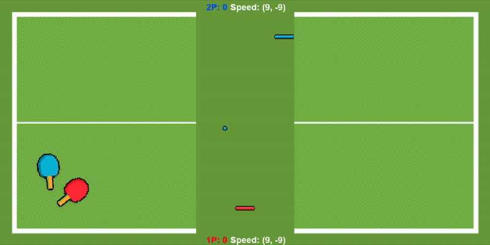

# 乒乓球

 


[](https://www.python.org/downloads/release/python-390/)
[](https://github.com/PAIA-Playful-AI-Arena/MLGame)


想要體驗一場有趣且刺激的乒乓球遊戲嗎？設計你的 AI 移動板子，將球回擊，要注意球速會愈來愈快喔，你能在乒乓球對戰中獲勝嗎？

- `遊戲目標` &nbsp;&nbsp;&nbsp; 讓對手沒接到球，自己的分數達到`*獲勝分數`
- `失敗條件`&nbsp;&nbsp;&nbsp; 對手的分數達到`*獲勝分數`
- `平手條件`&nbsp;&nbsp;&nbsp; 球速超過 `40`，雙方會各獲得一分
- `獲勝分數`：指定遊戲結束的分數，預設為 3。當任一方得到指定的分數時，就結束遊戲。



# 更新內容(3.0.1)
1. 更新遊戲物件尺寸，更新遊戲畫面
2. 調整資料格式，符合 `MLGame 10.4.6a2` 以後版本

---

# 遊戲參數設定

```python
# main.py 
game = PingPong(difficulty="HARD", game_over_score=5,user_num=2,init_vel=7)

```

- `difficulty`：遊戲難度
    - `NORMAL`：加入切球機制
    - `HARD`：加入切球機制與障礙物
- `game_over_score`：指定遊戲結束的分數。當任一方得到指定的分數時，就結束遊戲。預設是 `3`，但如果啟動遊戲時有指定 `-1`
  選項，則結束分數會是 `1`。
- `init_vel`：設定初始球的 `X` 與 `Y` 速度。 預設為 `7`。

# 玩法

- 將球發往左邊/右邊
    - 1P:  `.`、`/`
    - 2P:  `Q`、`E`
- 移動板子
    - 1P: 左右方向鍵
    - 2P: `A`、`D`

1P 在下半部，2P 在上半部


# 座標系統

- 使用 pygame 座標系統，`左上角為 (0,0)`，`X軸` 以 `右` 為正，`Y軸` 以 `下` 為正，單位為 px。
- 本遊戲所提供的座標，皆是物體`左上角`的座標。
- 螢幕大小 200 x 500
- 板子 40 x 10
- 球 10 x 10
- 障礙物 30 x 20
  
# 遊戲物件


## 玩家板子

- 長方形板子，1P 是紅色的，2P 是藍色的。
- 板子移動速度是每個影格 (±5, 0)。
- 1P 板子的初始位置在 (80, 420)，2P 則在 (80, 70)。

## 球

- 綠色正方形。
- 每場遊戲開始時，都是由 1P 先發球，之後每個回合輪流發球。
- 球由板子的位置發出，可以選擇往左或往右發球。如果沒有在 150 影格內發球，則會隨機方向發球。
- 初始球速是每個影格 (±7, ±7)，發球後每 `100` 影格增加 `1`。

## 障礙物

- 黃色矩形。
- x 初始位置在 0 到 180 之間，每 20 為一單位隨機決定，y 初始位置固定在 240，移動速度為每影格 (±5, 0)。
- 障礙物會來回移動，初始移動方向是隨機決定的。
- 球撞到障礙物會保持球的速度。
- 只會出現在`困難`的難度中。

# 切球機制
球的 `X軸` 速度會因為接球時板子的移動方向而改變


1. 板子與球的移動方向`相同`，球的 `X軸` 速度會增加 `3`
2. 板子與球的移動方向`相反`，球會被打回`反方向`，速度不變
3. 板子不動，球依照反彈原理反彈，速度不變


# 遊戲模式：

- **一般模式**：兩位玩家互相回擊對戰
- **困難模式**：對戰中會加入`障礙物`

# 適用賽制
- `淘汰賽`
---

# 進階說明

## 使用ＡＩ玩遊戲

```bash
# 在 pingpong 資料夾中打開終端機 
python -m mlgame -i ./ml/ml_play_template_1P.py -i ./ml/ml_play_template_2P.py  ./ --difficulty HARD --game_over_score 3  --init_vel 10
```

## ＡＩ範例

```python

class MLPlay:
    def __init__(self, ai_name, *args, **kwargs):
        """
        Constructor

        @param ai_name A string "1P" or "2P" indicates that the `MLPlay` is used by
               which side.
        """
        self.ball_served = False
        self.side = ai_name
        print(kwargs)

    def update(self, scene_info, *args, **kwargs):
        """
        Generate the command according to the received scene information
        """
        if scene_info["status"] != "GAME_ALIVE":
            return "RESET"

        if not self.ball_served:
            self.ball_served = True
            return "SERVE_TO_RIGHT"
        else:
            return "MOVE_LEFT"

    def reset(self):
        """
        Reset the status
        """
        print("reset " + self.side)
        self.ball_served = False

```

## 初始化參數

- ai_name: 字串。其值只會是 `"1P"` 或 `"2P"`，代表這個程式被哪一邊使用。
- kwargs: 字典。裡面會包含遊戲初始化的參數
  ```json

    {"game_params": 
      {
        "difficulty": "HARD",
        "game_over_score": 3
      }
    }

    ```

## 遊戲資訊

- scene_info 的資料格式如下

```json
{
  "frame": 24,
  "status": "GAME_ALIVE",
  "ball": [
    63,
    241
  ],
  "ball_speed": [
    7,
    7
  ],
  "ball_served": true,
  "serving_side": "2P",
  "platform_1P": [
    0,
    420
  ],
  "platform_2P": [
    0,
    70
  ],
  "blocker": [
    140,
    240
  ]
}

```

- `frame`：遊戲畫面更新的編號
- `status`：字串。目前的遊戲狀態，會是以下的值其中之一：
    - `GAME_ALIVE`：遊戲正在進行中
    - `GAME_1P_WIN`：這回合 1P 獲勝
    - `GAME_2P_WIN`：這回合 2P 獲勝
    - `GAME_DRAW`：這回合平手
- `ball` `(x, y)` tuple。球的位置。
- `ball_speed`：`(x, y)` tuple。目前的球速。
- `ball_served`：`true` or `false` 布林值 boolean。表示是否已經發球。
- `serving_side`：`1P` or `2P`  字串 string。表示發球方。
- `platform_1P`：`(x, y)` tuple。1P 板子的位置。
- `platform_2P`：`(x, y)` tuple。2P 板子的位置。
- `blocker`：`(x, y)` tuple。障礙物的位置。如果選擇的難度不是 `HARD`，則其值為 `None`。

## 動作指令

- 在 update() 最後要回傳一個字串，主角物件即會依照對應的字串行動，一次只能執行一個行動。
    - `SERVE_TO_LEFT`：將球發向左邊
    - `SERVE_TO_RIGHT`：將球發向右邊
    - `MOVE_LEFT`：將板子往左移
    - `MOVE_RIGHT`：將板子往右移
    - `NONE`：無動作

## 遊戲結果

- 最後結果會顯示在 console 介面中，若是 PAIA 伺服器上執行，會回傳下列資訊到平台上。

```json
{
  "frame_used": 54,
  "status": "finish",
  "attachment": [
    {
      "player_num": "ml_1P",
      "rank": 1,
      "score": 1,
      "status": "GAME_PASS",
      "ball_speed": [
        7,
        -7
      ]
    },
    {
      "player_num": "ml_2P",
      "rank": 2,
      "score": 0,
      "status": "GAME_OVER",
      "ball_speed": [
        7,
        -7
      ]
    }
  ]
}
```

- `frame_used`：表示使用了多少個 frame
- `status`：表示遊戲結束的狀態
  - `finish`:完成此遊戲
  - `fail`:遊戲過程出現問題
  - `passed`:單人的情況下，成功走到終點，回傳通過
  - `un_passed`:單人的情況下，成功走到終點，回傳不通過
- `attachment`：紀錄遊戲各個玩家的結果與分數等資訊
    - `player_num`：玩家編號
    - `rank`：排名
    - `score`：各玩家獲勝的次數
    - `status`：玩家的狀態
        - `GAME_PASS`：該玩家獲勝
        - `GAME_OVER`：該玩家失敗
        - `GAME_DRAW`：雙方平手
    - `ball_speed`：球的速度

## 關於球的物理

球在移動中，下一幀會穿牆的時候，會移動至球的路徑與碰撞表面的交點。


---
