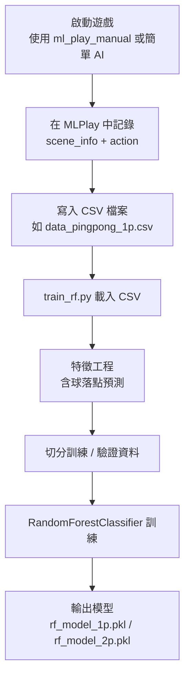
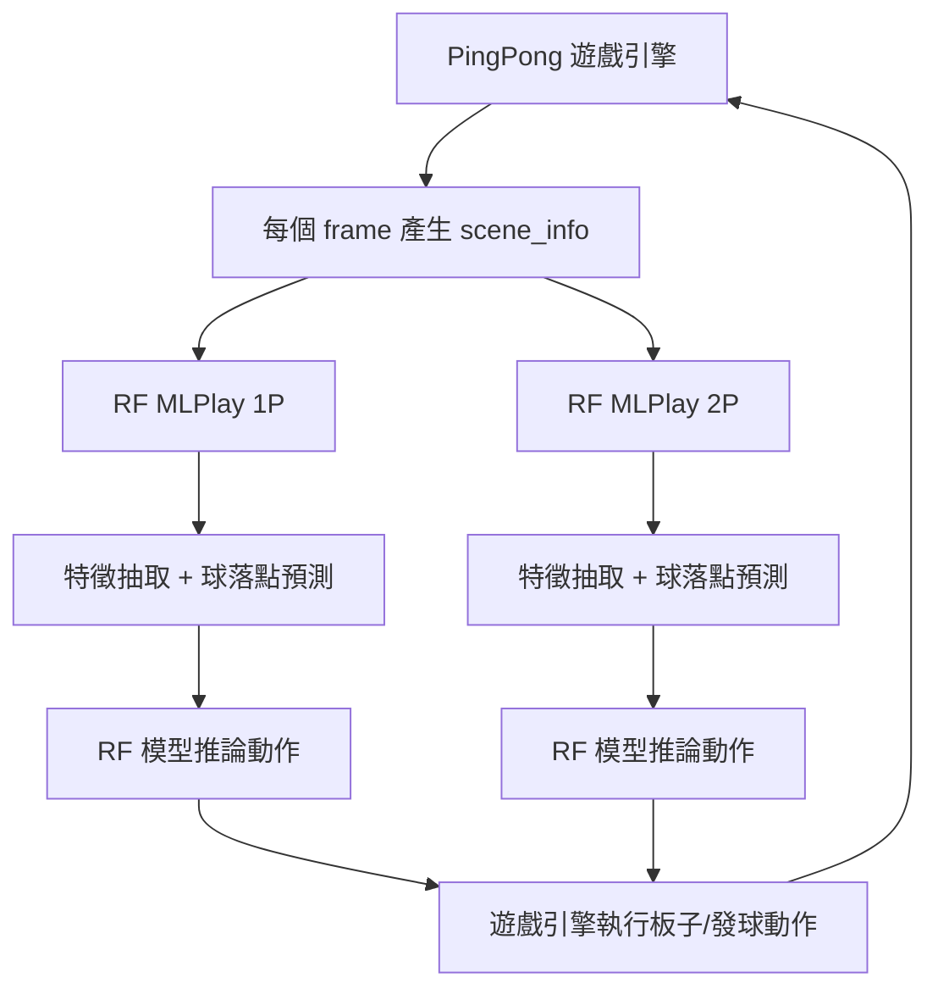

## 系統規格

- **作業系統**: Windows 10 (其他支援 Python 3.9+ 的作業系統亦可)
- **Python 版本**: **3.9 以上**
- **主要套件**
  - **mlgame >= 10.4.6a2**（遊戲框架）
  - **pygame**（由 mlgame 依賴提供）
  - **scikit-learn >= 1.0**（隨機森林訓練與推論）
  - **numpy**（特徵處理與向量運算）
  - **pandas**（訓練資料讀寫與前處理）
  - **joblib**（模型存取）

---

## 系統拆解 (Breakdown)

- **遊戲核心 (`src/` 下)**
  - **`game.py`**: `PingPong` 主遊戲類別，負責：
    - 遊戲主迴圈邏輯（分數、回合重置、勝負判定、平手條件）
    - 呼叫 `Ball`、`Platform`、`Blocker` 的更新與碰撞檢查
    - 將場景資訊 (`scene_info`) 傳給 AI（包含球 / 板子 / 障礙物位置與速度）
  - **`game_object.py`**:
    - `Ball`: 球的移動、加速、碰撞偵測與「切球機制」實作
    - `Platform`: 玩家板子移動與座標
    - `Blocker`: 困難模式下中間的移動障礙物
  - **`env.py` / `utils.py`**: 圖像資源、螢幕與背景偏移常數、座標轉換等。

- **AI 腳本 (`ml/` 下)**
  - **`ml_collect_data.py`**:
    - 以物理落點策略來收集1p、2p的scene info。
  - **`ml_play_manual.py`**:
    - 透過鍵盤控制產生指令，適合人工對戰與資料蒐集。
  - **新增 RF AI（本次實作）**
    - **`ml_play_rf_1P.py`**: 使用隨機森林模型控制 1P。
    - **`ml_play_rf_2P.py`**: 使用隨機森林模型控制 2P。
    - **`rf_utils.py`**: 特徵工程、球落點預測與模型載入工具。
    - **`train_rf.py`**: 統一訓練與儲存 1P / 2P RF 模型的腳本。

- **資料與模型**
  - **資料來源**: 透過 `ml_play_manual.py` 或任何自訂 AI 對戰時記錄的 `(scene_info, action)`。
  - **特徵向量**:
    - 球位置與速度：`ball_x`, `ball_y`, `ball_vx`, `ball_vy`
    - 板子位置：`platform_x`
    - 障礙物位置（困難模式使用）：`blocker_x`, `blocker_y`
    - **物理落點預測**：`pred_landing_x`（球在板子高度的預估落點）
  - **標籤 (Label)**:
    - 離散動作: `["MOVE_LEFT", "MOVE_RIGHT", "NONE", "SERVE_TO_LEFT", "SERVE_TO_RIGHT"]`

---

## 流程圖 (整體資料與控制流程)

### 1. 資料收集與訓練流程

### 2. 遊戲對打與推論流程

---

## 訓練過程設計

- **步驟 1：蒐集資料**
  - 方式一：使用 `ml_play_manual.py`，由人類玩家操作 1P / 2P，並於每個 `update()` 中把 `scene_info` 與對應的輸出指令紀錄到 CSV。
  - 方式二：使用簡單規則 AI（例如固定往球落點移動的 rule-based AI），在對打過程中同樣記錄 `(scene_info, action)`。
  - 將 **1P 與 2P 分開存檔**（例如 `data_1p.csv`, `data_2p.csv`），方便針對不同位置與視角訓練。

- **步驟 2：特徵工程**
  - 對每一筆資料，從 `scene_info` 抽取：
    - `ball_x`, `ball_y`
    - `ball_speed_x`, `ball_speed_y`
    - `platform_1P_x` 或 `platform_2P_x`（依照是哪一方）
    - `blocker_x`, `blocker_y`（若 `difficulty == HARD`，否則填預設值 0）
  - 使用 `rf_utils.py` 中的「球落點預測」函式：
    - 輸入：當前球位置與速度、目標板子高度 (`y = 420` for 1P, `y = 70` for 2P)、場地寬度 200。
    - 考慮：X 軸牆壁反彈（0 與 200）、Y 軸上/下邊界反彈（0 與 500），不考慮板子與障礙物產生的切球，作為近似。
    - 輸出：`pred_landing_x`，作為 RF 重要特徵。

- **步驟 3：模型訓練 (Random Forest)**
  - 使用 `train_rf.py`：
    - 載入 1P / 2P 資料集 CSV。
    - 切分訓練 / 驗證集（例如 8:2）。
    - 模型：`RandomForestClassifier(n_estimators=200, max_depth=None, random_state=0, n_jobs=-1)`。
    - 評估：
      - 計算訓練與驗證集準確率。
      - 可視需要輸出混淆矩陣，檢查各動作預測效果。
    - 將模型儲存為：
      - `models/rf_model_1p.pkl`
      - `models/rf_model_2p.pkl`

- **步驟 4：在 MLPlay 中載入模型**
  - `ml_play_rf_1P.py` / `ml_play_rf_2P.py`：
    - 在 `__init__` 時用 `joblib.load()` 載入對應模型。
    - 在 `update()`：
      - 若 `scene_info["status"] != "GAME_ALIVE"` 回傳 `"RESET"`。
      - 計算特徵向量（同訓練時流程，包含 `pred_landing_x`）。
      - 呼叫 RF 模型得到動作分類結果（字串）。
      - 將字串直接回傳給遊戲框架。

---

## 如何驗收

- **功能驗收**
  - 1P / 2P 都使用 RF 模型：
    - 指令示意 (以 MLGame 執行為例)：
      - `python -m mlgame -f 60 -i ./ml/ml_play_rf_1P.py -i ./ml/ml_play_rf_2P.py ./ --difficulty HARD --game_over_score 3 --init_vel 7`
  - 檢查：
    - 遊戲可以正常啟動，不會拋出模型讀取錯誤（檔案路徑與名稱正確）。
    - RF AI 能自動發球與移動板子，雙方能完成數回合對打。

- **效能與表現驗收**
  - **對比基準**：
    - 以範例模板 AI (`ml_play_template_1P/2P`) 或簡單 rule-based AI 做為 baseline。
  - **指標**：
    - RF AI 對戰中，平均回合長度（frame 數）是否比 baseline 更長（代表防守較佳）。
    - RF AI 對戰中，錯失球的次數是否下降。
    - 針對單邊 RF AI vs baseline 測試：
      - RF AI 的勝率是否高於 50%。

- **穩定性驗收**
  - 在 `difficulty="HARD"`、`init_vel=7`、`fps=60` 下連續跑多局：
    - 不應有例外錯誤或 FPS 明顯下降。
    - 球速增加與平手條件（球速 > 40）仍正常觸發，遊戲規則保持正確。

- **可重現性**
  - 依照「訓練過程設計」章節：
    - 重新蒐集資料、訓練模型後，能產出新的 `.pkl` 檔，並可直接替換舊模型。
    - 在相同訓練資料與隨機種子設定下，多次訓練結果應具有相近的驗證準確率與遊戲表現。

---

## 使用步驟總結

- **1. 安裝環境**
  - `pip install -r requirements.txt`

- **2. 蒐集資料**
  - 使用 `python ml/ml_collect_data.py` 或自訂 AI，記錄對戰資料到 CSV。

- **3. 訓練模型**
  - 執行 `python ml/train_rf.py`（依照腳本內說明指定資料與輸出路徑）。

- **4. 啟動 RF AI 對打**
  - `python -m mlgame -f 60 -i ./ml/ml_play_rf_1P.py -i ./ml/ml_play_rf_2P.py ./ --difficulty HARD --game_over_score 3 --init_vel 7`

- **5. 評估結果**
  - 比較與 baseline 的勝率、平均回合長度與錯失球次數，確認 RF AI 的效果。

