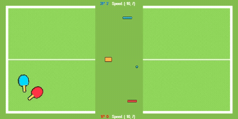
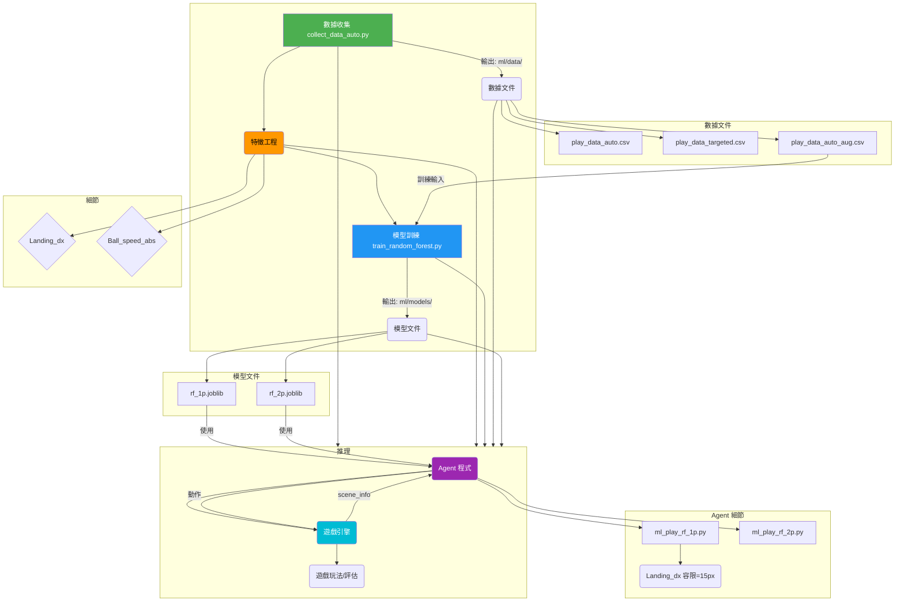

# ML PingPong ---  API 說明


------------------------------------------------------------------------

# 目錄

-   [`ml_play_rf_1p.py`](#ml_play_rf_1ppy-----隨機森林一號玩家-ai)
-   [`ml_play_rf_2p.py`](#ml_play_rf_2ppy-----隨機森林二號玩家-ai)
-   [`train_random_forest.py.py`](#train_random_forest.py-----隨機森林訓練-ai)
-   [`landing.py`](#landingpy-----落點預測引擎-v2)


------------------------------------------------------------------------

# `ml_play_rf_1p.py` --- 隨機森林一號玩家 AI

## 功能

使用訓練好的 Random Forest
模型，根據場景資訊預測一號玩家（1P）應該採取的行動。

## 類別

### `MLPlay(player, *args, **kwargs)`

## 方法

------------------------------------------------------------------------

### `update(scene_info) → action (str)`

#### 輸入 (`scene_info` dict)

  `ball`                (x, y) 球的位置

  `ball_speed`          (vx, vy) 球速

  `platform_1P`         (x, y) 1P 板子位置

  `platform_2P`         (x, y) 2P 板子位置

  `blocker`（選擇性）   (x, y) 或 (0,0)

  `frame`               當前 frame 數

  `status`              `"GAME_ALIVE"` 或 `"GAME_OVER"`

#### 輸出（string 行動）

  動作
  --------------------
  `"MOVE_LEFT"`

  `"MOVE_RIGHT"`

  `"NONE"`

  `"SERVE_TO_LEFT"`

  `"SERVE_TO_RIGHT"`


------------------------------------------------------------------------

### `reset()`

重設內部狀態（比賽重新開始時由 mlgame 呼叫）


------------------------------------------------------------------------

# `ml_play_rf_2p.py` --- 隨機森林二號玩家 AI

和 `ml_play_rf_1p.py` 結構相同，但：

-   使用 2P 的模型
-   依照 2P 的視角作判斷
-   控制的板子是 **平台 2P**

------------------------------------------------------------------------

### `predict(scene_info) → action (str)`

#### 輸入

同 `update(scene_info)` 的 scene_info。

#### 輸出

-   `"MOVE_LEFT"`

-   `"MOVE_RIGHT"`

-   `"NONE"`

-   `"SERVE_TO_LEFT"`

-   `"SERVE_TO_RIGHT"`

### `reset()`

重設內部狀態（比賽重新開始時由 mlgame 呼叫）

------------------------------------------------------------------------
# `train_random_forest.py` --- 隨機森林訓練-ai

#### 輸入
player_side (str): '1P' 或 '2P'。

n_estimators (int): 樹的數量。

max_depth (int): 樹的深度。

balance (bool): 是否進行資料平衡。

class_weight (bool): 是否使用類別權重。

#### 輸出
model_path (str): 儲存的模型檔案路徑 (例如 'ml/models/rf_1p.joblib')。

------------------------------------------------------------------------

# `landing.py` --- 落點預測

## 功能

根據 mlgame 的真實物理：

-   模擬球的後續運動
-   處理反彈、牆壁、平台與 blocker 的碰撞
-   返回最後會落在哪個 x 位置（landing X）
-   避免高速球穿透平台
-   使用 LRU cache（快 10～30 倍）

------------------------------------------------------------------------

##  API

------------------------------------------------------------------------

### `simulate_landing_x(scene, max_steps=200, p1_vx=0, p2_vx=0, return_steps=False) → float 或 (float, None)`

#### 輸入

  `scene`          場景 dict

  `max_steps`      最大模擬步數

  `p1_vx`          1P 板子速度（預設 0）


  `p2_vx`          2P 板子速度
  
  `return_steps`   若為 True，回傳 `(落點, None)`

#### 輸出

-   `landing_x`（float）
-   或 `(landing_x, None)`

> **注意：**為了相容，`return_steps=True` 仍提供 steps
> 欄位，但當前版本不回傳真實步數。

------------------------------------------------------------------------

### `get_predicted_landing(scene, max_steps=200, p1_vx=0, p2_vx=0, return_steps=False)`

**功能：** - LRU cache - 同一 frame 共享預測結果 - 呼叫者多為 1P/2P
agent

輸入/輸出與 `simulate_landing_x` 相同。

------------------------------------------------------------------------


# PingPong ML 系統架構

## Breakdown



---

## ML說明

### 1. 遊戲引擎層 (`src/`)

| 文件 | 功能 |
|------|------|
| `game.py` | PingPong 遊戲主類<br>- 初始化球、平台<br>- update() 每幀更新物理 |
| `game_object.py` | Ball, Platform 類<br>- Ball: 碰撞、速度更新、切球效果<br>- Platform: 位置、輸入響應 |
| `utils.py` | 工具函數 |

**關鍵參數**: 
- 初始球速: `init_vel=7`
- 難度: EASY (無切球) / HARD (有切球)
- 得分目標: `game_over_score`

---

### 2. 著陸預測層 (`ml/landing.py`)

**目的**: 預測球會在何處著陸（沒有平台干預）

**流程**:
```python
get_predicted_landing(scene_info, p1_vx, p2_vx, return_steps=False)
├─ simulate_landing_x(ball, platform, max_steps=100)
│  ├─ 逐幀計算球軌跡
│  ├─ 檢測邊界碰撞 (rect.colliderect)
│  ├─ 檢測切球 (slice_ball 邏輯)
│  └─ 返回最終著陸 X 座標
└─ 快取結果（同幀重複查詢）
```

**優化**:
- `max_steps=100` (從 200 降低 → 速度 +50%)
- `n_jobs=1` (禁用多進程開銷)
- 幀級快取 (避免重複計算)

---

### 3. 數據收集層

#### 3.1 基礎收集 (`collect_data_auto.py`)
- **輸出**: `play_data_auto.csv` (20k 行)
- **方法**: 啟發式 agent vs 啟發式 agent
- **特點**: 簡單場景，易平衡
- **過濾**: 無特殊過濾

#### 3.2 難例收集 (`collect_targeted.py`)
- **輸出**: `play_data_targeted.csv` (10k 行)
- **方法**: 啟發式 agent vs 啟發式 agent，但僅記錄難例
- **過濾**: `球速 ≥12 OR |著陸誤差| ≥50px`
- **用途**: 提升 1P 難例能力

#### 3.3 特徵增強 (`augment_features.py`)
- **輸入**: `play_data_auto.csv`
- **輸出**: `play_data_auto_aug.csv`
- **新增特徵**:
  - `landing_dx`: 著陸點與平台中心距離
  - `ball_speed_abs`: 球速大小
  - `time_to_land`: 預計著陸時間（如可用）
- **目的**: 幫助模型識別難例特徵

---

### 4. 訓練層

#### 4.1 隨機森林訓練

**基礎訓練** (`train_random_forest.py`)
```python
RandomForestClassifier(
    n_estimators=100,      # 樹數量（精簡版）
    max_depth=12,          # 樹深度
    random_state=42,
    n_jobs=1,              # 單線程推理
    class_weight='balanced'
)
```
## 詳細步驟解析

### 步驟一：資料載入與過濾 (Data Loading & Filtering)
* **來源**：讀取 `data/play_data_auto.csv`。
* **玩家區分**：函式 `train_for(player_side)` 強制區分 `'1P'` 與 `'2P'`。
    * *原因*：1P（左側）與 2P（右側）的座標視角不同，動作邏輯相反，因此必須分開訓練兩個獨立的模型。

### 步驟二：特徵工程 (Feature Engineering)
程式碼定義了兩類特徵：
1.  **基礎物理特徵 (`BASE_FEATURES`)**：
    * `ball_x`, `ball_y` (球位置)
    * `ball_vx`, `ball_vy` (球速度)
    * `self_px`, `opp_px` (雙方板子 Y 座標)
    * `blocker_x` (障礙物，若有的話)
    * `pred_landing_x` (預測落點)
2.  **歷史特徵 (`HISTORY_FEATURES`)**：
    * 包含前 1 幀與前 2 幀的球速與位置 (`prev1_...`, `prev2_...`)。
    * *目的*：讓隨機森林能夠捕捉時間序列上的趨勢（例如加速度或變向）。

**標籤編碼 (Label Encoding)**：
* 將文字動作轉換為整數索引：
    * `NONE` -> 0
    * `MOVE_LEFT` -> 1
    * `MOVE_RIGHT` -> 2
    * ...以此類推。

### 步驟三：資料切分 (Train-Test Split)
使用 `sklearn.model_selection.train_test_split`：
* **訓練集 (Train Set)**：80% 資料，用於訓練。
* **測試集 (Test Set)**：20% 資料，用於驗證成效。
* `random_state=42`：確保每次切分結果一致。

### 步驟四：處理資料不平衡 (Handling Class Imbalance)
這是此腳本最關鍵的部分，因為遊戲中「移動」的次數遠多於「發球」。

#### 方法 A：手動過採樣 (Manual Oversampling)
* **觸發條件**：執行時帶入 `--balance` 參數。
* **邏輯**：
    1.  找出訓練集中樣本數最多的類別（Majority Class）。
    2.  針對其他少數類別（Minority Classes），使用 `sklearn.utils.resample` 進行 **有放回抽樣 (Replace=True)**。
    3.  將所有類別的樣本數強制拉升至與最大類別相同。
    4.  *優點*：確保模型充分學習到稀少動作（如發球）。

#### 方法 B：權重調整 (Class Weights)
* **觸發條件**：執行時帶入 `--class_weight` 參數。
* **邏輯**：設定 `class_weight='balanced'`，讓演算法在計算 Loss 時，自動給予稀少類別較高的懲罰權重。

### 步驟五：模型訓練 (Model Training)
使用 `RandomForestClassifier` 建立模型：
* **`n_estimators`** (預設 100)：決策樹的數量。
* **`max_depth`** (預設 12)：限制樹的深度，防止過度擬合 (Overfitting)。
* **`n_jobs=-1`**：啟用所有 CPU 核心平行運算加速。


---

### 5. 推理層（Agent）

#### 5.1 1P Agent (`ml_play_rf_1p.py`)

```
輸入: scene_info（球、平台、狀態）
  ↓
特徵提取: 構造 19D 特徵向量
  ├─ ball_x, ball_y, ball_vx, ball_vy
  ├─ self_px, opp_px, blocker_x
  ├─ pred_landing_x (著陸預測)
  ├─ prev1/prev2 歷史特徵
  └─ landing_dx = pred_landing_x - self_px
  ↓
模型推理: rf_1p.predict(features)
  ↓
後處理 & 安全檢查:
  ├─ landing_dx 容限: if |landing_dx| ≤ 15px → NONE
  ├─ 方向平滑: 避免 <4 幀內頻繁轉向
  └─ 安全覆蓋: 球快速接近且著陸在左時強制 MOVE_LEFT
  ↓
輸出: 行動 (NONE, MOVE_LEFT, MOVE_RIGHT, SERVE_*)
```

**關鍵參數**:
- `landing_dx 容限 = 20px` (應對切球)
- `方向平滑窗口 = 4 幀`
- `安全覆蓋閾值 = self_px - 8`

#### 5.2 2P Agent (`ml_play_rf_2p.py`)
- 相同架構，稍少後處理
- 用 `play_data_auto_aug` 訓練（無難例增強）

---

### 6. 評估層

#### 6.1 無頭評估 (`evaluate_models.py`)
- 執行 N 場遊戲（無 UI）
- 統計勝負、得分、幀數
- 輸出 CSV: `eval_results_*.csv`

#### 6.2 分析工具 (`analyze_failures.py`)
- 分析失敗日誌，提取著陸誤差分布
- 找出常見失誤模式

#### 6.3 視覺演示 (`run_selfplay.py`)
- Pygame 窗口顯示 1P vs 2P
- 目標 FPS: 60
- 遊戲結束時統計勝負

---

## 數據流

### 訓練時數據流

```
play_data_auto.csv (20k)
    ↓ augment_features
play_data_auto_aug.csv (20k, 19 features)
    ↓ + play_data_targeted.csv × 3
Combined Data (50k)
    ↓ train_test_split (80-20)
Train: 40k → RandomForest → rf_1p.joblib
Test: 10k → Evaluate → accuracy_report
```

### 推理時數據流

```
scene_info (球、平台、狀態)
    ↓ extract_features
19D 向量
    ↓ rf_1p.predict()
預測動作 ID (0-4)
    ↓ post_process
最終動作 (MOVE_LEFT etc)
    ↓ game.update()
新 scene_info
```

---

## 性能指標

| 指標 | 值 | 備註 |
|------|-----|------|
| **著陸預測** | 6.6ms/call | max_steps=100, n_jobs=1 |
| **模型推理** | 6.6ms/predict | RF 100×12 |
| **幀耗時預算** | 16.67ms@60fps | 已滿足 |
| **訓練速度** | ~30sec/模型 | n_est=100, depth=12 |
| **1P 準確度** | ~91.6% | 測試集 (20% split) |

---

## 常見調整點

| 調整項 | 檔案 | 行數 | 效果 |
|--------|------|------|------|
| 著陸容限 | `ml_play_rf_1p.py` | 131 | 影響反應敏銳度 |
| 模型大小 | `retrain_1p_targeted.py` | 67 | n_est & max_depth |
| 著陸精度 | `ml/landing.py` | 20 | `max_steps` |
| 方向平滑 | `ml_play_rf_1p.py` | 144 | 震盪頻率 |

# PingPong ML 訓練流程 - 簡化版指南

## 建立訓練環境

```bash
# 建立並啟動訓練環境（若尚未建立）
conda env create -f .\envs\pingpong-train.yml
conda activate pingpong-train
# 若pandas出現版本錯誤，請執行：
pip install --upgrade --force-reinstall --no-cache-dir "pandas>=2.0.3"
```

---

## 分步驟執行 (推薦用於調試)

### 1. 收集基礎數據 (10k 行)
```bash
python ml/collect_data_auto.py --target_rows 10000 
```
- 輸出: `ml/data/play_data_auto.csv`
- 內容: 簡單場景，作為訓練基礎

### 2. 收集難例數據 (10k 行)
```bash
python ml/collect_targeted.py --target_rows 10000 
```
- 輸出: `ml/data/play_data_targeted.csv`
- 過濾條件: 球速 ≥12 或著陸誤差 ≥50px

### 3. 增加特徵工程
```bash
python ml/evaluate_models.py
```
- 輸出: `ml/data/play_data_auto_aug.csv`
- 新增特徵: landing_dx, ball_speed_abs, time_to_land

### 4. 訓練 1P 模型 
```bash
python ml/retrain_1p_targeted.py
```
- 模型: `ml/models/rf_1p.joblib`
- 配置: n_estimators=100, max_depth=12, n_jobs=1
- 資料融合: 基礎數據 + 難例×3倍

### 5. 訓練 2P 模型
```bash
python ml/train_random_forest.py
```
- 模型: `ml/models/rf_2p.joblib`
- 配置: 同上
- 資料: 只用基礎數據


### 6. 視覺演示 
```bash
python ml/run_selfplay.py
```
- 啟動 Pygame 演示窗口，觀看 1P vs 2P 實際遊玩

---

## 系統配置速查表

| 組件 | 參數 | 說明 |
|------|------|------|
| **著陸預測** | max_steps=100 | 預測計算迭代，已優化速度 |
| **1P Agent** | landing_dx容限=15px | 著陸點容限，應對切球邊界 |
| **RF 模型** | n_estimators=100<br>max_depth=12<br>n_jobs=1 | 輕量模型 (6.6ms/推理) |
| **數據乘數** | multiplier=3 | 1P 訓練時難例重複次數 |

---

## 調試工作流

### 1p輸得很慘：
1. 檢查著陸容限: `ml/ml_play_rf_1p.py` 第 130-135 行，`landing_dx <= 20`
2. 嘗試增加難例比例: `--multiplier 5` 或重新收集更多難例

### 如果 FPS 還是低：
1. 檢查模型推理: `python ml/benchmark_model.py`（應 <6.6ms）
2. 檢查著陸計算: `ml/landing.py` 第 20 行，`max_steps=100`

### 如果想看詳細診斷：
```bash
python -m ml.analyze_failures
```

---

## 關鍵文件清單

| 檔案 | 用途 |
|------|------|
| `ml/landing.py` | 著陸預測引擎（已優化） |
| `ml/ml_play_rf_1p.py` | 1P Agent（landing_dx=20） |
| `ml/ml_play_rf_2p.py` | 2P Agent |
| `ml/models/rf_1p.joblib` | 1P 模型 (n_est=100, depth=12) |
| `ml/models/rf_2p.joblib` | 2P 模型 (n_est=100, depth=12) |

---

## 典型執行時間

| 步驟 | 時間 |
|------|------|
| collect_auto (20k) | ~10 min |
| collect_targeted (10k) | ~5 min |
| augment | <1 sec |
| train_1p | ~30 sec |
| train_2p | ~30 sec |
| evaluate (20 matches) | ~2 min |
| **Total (all)** | **~20 min** |

---

## 常見問題

**Q: 要重新訓練嗎？**  
A: 如果要改模型配置（n_estimators, max_depth）或重新收集數據，需要重跑 train_1p / train_2p。

**Q: 數據可以重用嗎？**  
A: 是的。如果只改 Agent 邏輯（landing_dx容限等），不需重新訓練，直接修改 `ml_play_rf_1p.py` 重啟遊戲。
