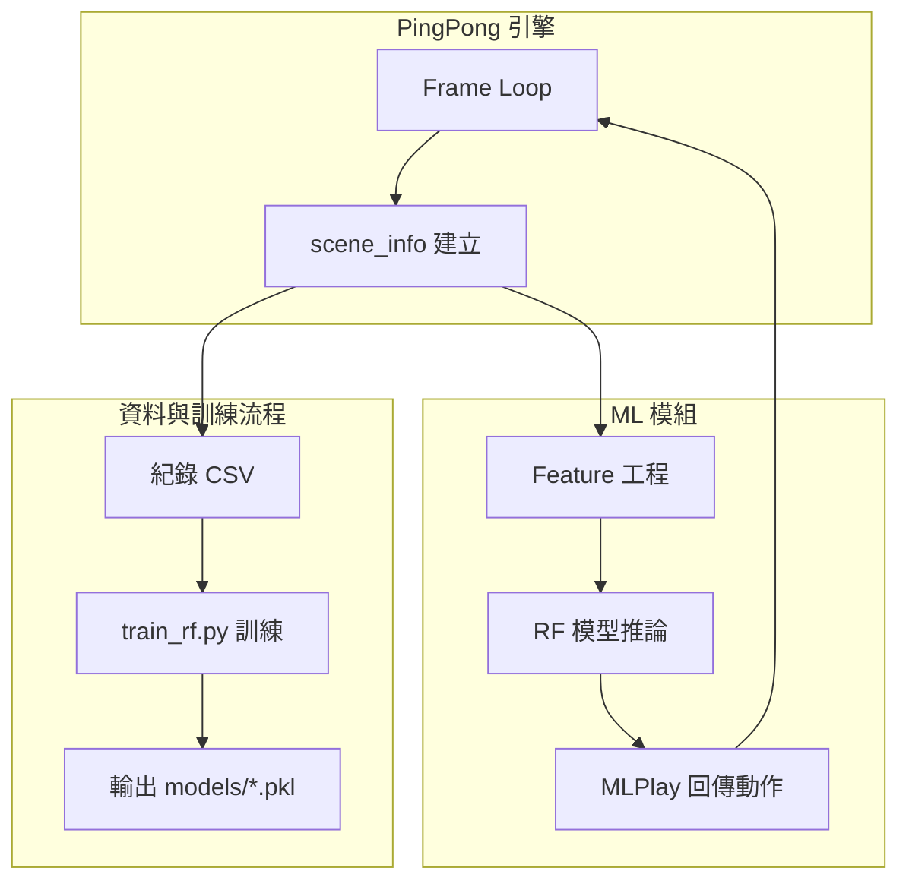
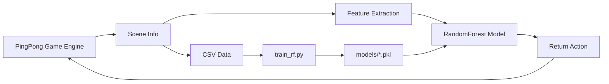

## 系統規格

- **作業系統**: Windows 10 (其他支援 Python 3.9+ 的作業系統亦可)
- **Python 版本**: **3.9 以上**
- **主要套件**
  - **mlgame >= 10.4.6a2**（遊戲框架）
  - **pygame**（由 mlgame 依賴提供）
  - **scikit-learn >= 1.0**（隨機森林訓練與推論）
  - **numpy**（特徵處理與向量運算）
  - **pandas**（訓練資料讀寫與前處理）
  - **joblib**（模型存取）

---

## 系統拆解 (Breakdown)

Breakdown（Mermaid 可視化）

以下為建議的 Mermaid flowchart（可直接貼到支援 Mermaid 的編輯器或 GitHub Preview）：


```mermaid
flowchart TD
  subgraph GameEngine[PingPong 引擎]
    A1[Frame Loop]
    A2[scene_info 建立]
  end

  subgraph ML[ML 模組]
    B1[Feature 工程]
    B2[RF 模型推論]
    B3[MLPlay 回傳動作]
  end

  subgraph Data[資料與訓練流程]
    C1[紀錄 CSV]
    C2[train_rf.py 訓練]
    C3[輸出 models/*.pkl]
  end

  A1 --> A2
  A2 --> B1
  B1 --> B2
  B2 --> B3
  B3 --> A1

  A2 --> C1
  C1 --> C2
  C2 --> C3
```

---

## 快速上手

- 安裝套件:

```bash
pip install -r requirements.txt
```

- 蒐集資料（範例，使用人工或 rule-based AI）：

```bash
python ml/ml_collect_data.py
```

- 訓練 RF 模型：

```bash
python ml/train_rf.py
```

- 啟動遊戲（載入 1P 與 2P MLPlay）：

```bash
python -m mlgame -f 60 -i ./ml/ml_play_rf_1P.py -i ./ml/ml_play_rf_2P.py ./ --difficulty HARD --game_over_score 3 --init_vel 7
```

---

## **API（主要函式與使用說明）**

下表列出專案中常用且對外可呼叫的函式（或在 MLPlay 中會被框架呼叫的介面），包含輸入/輸出與簡短使用範例：

| Function 名稱 | 輸入 | 輸出 | 使用方法 |
|---|---|---|---|
| `ml.rf_utils.predict_landing_x_for_1p(scene_info_ball)` | `ball_pos: (x,y)`, `ball_speed: (vx,vy)` | `pred_x: float` | 預估球會落在 1P 橫向位置。用於建立特徵向量。|
| `ml.rf_utils.predict_landing_x_for_2p(ball_pos, ball_speed)` | 同上（針對 2P 方向） | `pred_x: float` | 同上，針對 2P。|
| `ml.rf_utils.build_feature_vector_1p(scene_info)` | `scene_info: dict` | `np.ndarray` (1D) | 從 `scene_info` 抽取特徵（含 `pred_landing_x`），回傳模型輸入向量。|
| `ml.rf_utils.build_feature_vector_2p(scene_info)` | `scene_info: dict` | `np.ndarray` | 同上但針對 2P。|
| `ml.rf_utils.load_model(model_path)` | `model_path: str` | `sklearn` 模型物件 | `joblib.load()` 封裝，用於 MLPlay 初始化時載入模型。|
| `ml.train_rf.train_for_side(side, csv_path, model_output_path)` | `side: str ('1p'|'2p')`, `csv_path: Path`, `model_output_path: Path` | `None` (輸出 pkl) | 讀取 CSV，做特徵工程並訓練 RF，最後將模型存成 pkl。|
| `ml.ml_play_rf_1P.MLPlay.update(scene_info)` | `scene_info: dict` (由 mlgame 傳入) | `action: str` | MLGame 框架在每個 frame 呼叫；實作需回傳動作字串。|
| `ml.ml_play_rf_2P.MLPlay.update(scene_info)` | 同上 | `action: str` | 同上，用於 2P。|
| `ml.ml_collect_data._log_row(path, side, scene_info, action)` | 路徑、方位、場景資訊、動作字串 | `None`（寫入 CSV） | 將場景與動作記錄到 CSV，用於訓練資料生成。|
| `src.game.PingPong.get_data_from_game_to_player()` | `self` | `dict` (scene_info) | 遊戲內部用，回傳場景資訊供 MLPlay 使用。|
| `src.game.PingPong.get_scene_init_data()` | `self` | `dict` | 回傳場景初始化資料（設定/初始位置等）。|
| `src.game.PingPong.get_scene_progress_data()` | `self` | `dict` | 回傳當前 frame 的場景進度資料。|
| `src.utils.shift_left_with_bg_width(pos: tuple)` | `pos: tuple` | `tuple` | 工具函式，處理背景偏移後的座標轉換。|

使用說明範例：在 MLPlay 的 `__init__`:

```python
from ml.rf_utils import load_model, build_feature_vector_1p
model = load_model('models/rf_model_1p.pkl')

def update(scene_info):
    x = build_feature_vector_1p(scene_info)
    action = model.predict([x])[0]
    return action
```

---

## Breakdown（更詳細的 Mermaid 範例）

如果你要把 Breakdown 畫成更清楚的 component 流程圖，這是一個較完整的 Mermaid 範例（貼到支援 Mermaid 的編輯器即可）：


```mermaid
flowchart LR
  Game[PingPong Game Engine]
  Scene[Scene Info]
  Features[Feature Extraction]
  RFModel[RandomForest Model]
  Action[Return Action]
  CSV[CSV Data]
  Trainer[train_rf.py]
  Models[models/*.pkl]

  Game --> Scene
  Scene --> Features
  Features --> RFModel
  RFModel --> Action
  Action --> Game

  Scene --> CSV
  CSV --> Trainer
  Trainer --> Models
  Models --> RFModel
```

---

若你希望我直接把 README 裡的 API 表格改成只列出某些檔案（例如只列 `ml/` 下函式），或要我加入更完整的範例程式碼（例如 `train_rf.py` 的 CLI 使用說明），請告訴我想要聚焦的範圍，我會再微調並 push 更新。
- **3. 訓練模型**

  - 執行 `python ml/train_rf.py`（依照腳本內說明指定資料與輸出路徑）。


- **4. 啟動 RF AI 對打**

